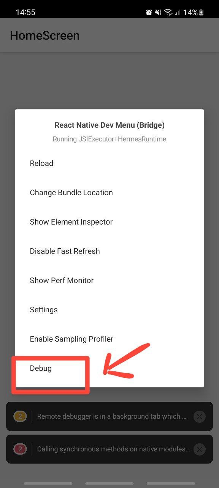
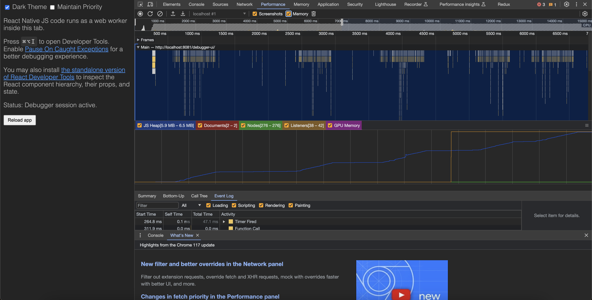
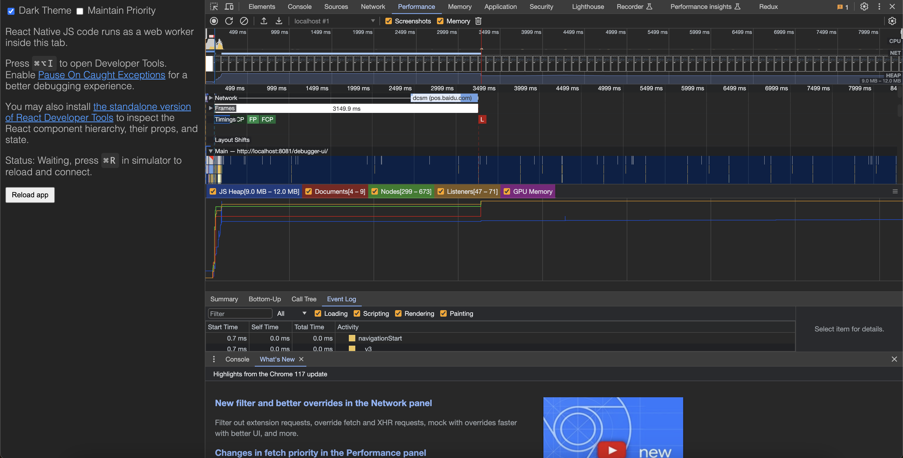

# Identifying the memory leak

This is a brief description of the identification of the memory leak problem noticed in the app.

## Getting Started

To get started and launch the app, follow the [Guide](./START.md).

## Description

The memory leak happens when a variable is not freed from the memory, which impacts the performance of the overall application.
This problem increases as the app is being used.

## Identification of the memory leak

To identify the memory leak: 
1. We use chrome tools
2. Open the bridge menu in Android (or iOS) and select the Debug option
3. This opens Chrome and we select the performance option in the inspector window.
4. We launch the recording and open [Leak 1](./Leak1.js) screen and notice a memory leak, increasing memory when we open and close screen.
5. This produces a similar result for [Leak 2](./Leak2.js).

| Bridge menu | Performance Analysis |
|-------------|----------------------|
|  |  |

## Fixing the memory leak

To fix the memory leak, we have a look at the code and notice that the **memory** variable is allocated a value on initialization but is not resolved when the component is unmounted. We fix this by adding the line in the code:
1. Leak 1:
```ts
    //...

    componentWillUnmount() {
        clearInterval(this.interval);
        this.memory = null; // <---Add this line
    }

    //...
```

2. Leak 2:
The memory leak occurs in the NamesList component and should be fixed.
```ts
    //...

    componentWillUnmount() {
        this.memory = null; // <---Clear the memory variable
    } 

    //...
```

We now notice a steady Heap memory:
| Heap memory |
|-------------|
| 

## Conclusion

Fixing memory leak required attention, and this work being not perfect, your opinion matters, let me know what you think.